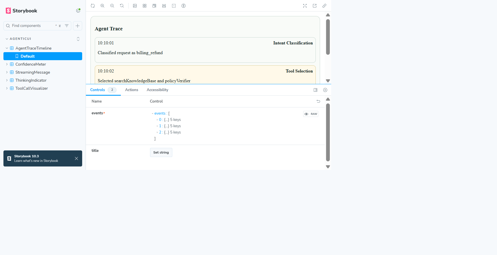

# agentic-ui

A production-ready React component library for AI agent interfaces.

## UI Preview



## Production Readiness

- CI gates for typecheck, test coverage, package build, and Storybook build
- Tag-based npm publishing workflow
- GitHub Pages workflow for Storybook docs hosting
- Operations and rollback runbook in `docs/OPERATIONS.md`

## Core Components

- StreamingMessage: token-by-token response rendering with accessible live updates
- ToolCallVisualizer: compact timeline of tool calls and statuses
- AgentTraceTimeline: ordered reasoning/trace event timeline
- ConfidenceMeter: confidence score bar with configurable thresholds
- ThinkingIndicator: subtle async state indicator for agent response phases

## Why This Library Exists

Most teams building agent products reinvent the same UI primitives. agentic-ui provides consistent, accessible, reusable components focused on agent workflows.

## Install

```bash
npm install agentic-ui
```

## Usage

```tsx
import { StreamingMessage, ToolCallVisualizer } from "agentic-ui";
import "agentic-ui/styles.css";
```

## Local Development

```bash
npm install
npm run typecheck
npm run test:ci
npm run build
npm run storybook
```

## Publishing

Tag-based release workflow supports npm publishing.
Storybook deployment is handled by the GitHub Pages workflow.

See docs/DEPLOYMENT.md for configuration requirements.

## CI/CD Workflows

- `.github/workflows/ci.yml`: typecheck + tests + package build + Storybook build
- `.github/workflows/release.yml`: npm publish on semantic tags (`vX.Y.Z`)
- `.github/workflows/pages.yml`: Storybook deployment to GitHub Pages

## Required GitHub Configuration

1. Add repository secret `NPM_TOKEN` for npm publishing.
2. Set Pages source to `GitHub Actions` in repository settings.
3. Create a semantic tag and push it:

```bash
git tag v0.1.0
git push origin v0.1.0
```

## Current Status

- v0.1.0 baseline: deploy-ready package build + Storybook docs pipeline
- Next: transcript virtualization, visual regression tests, and theme presets
